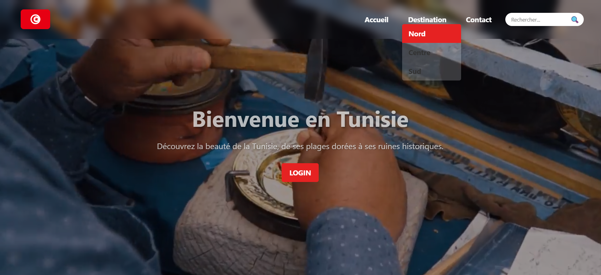
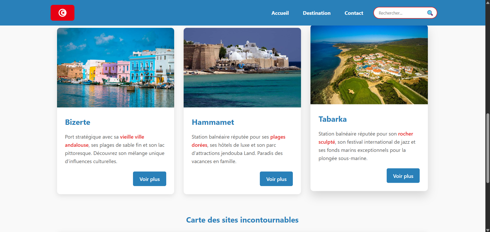
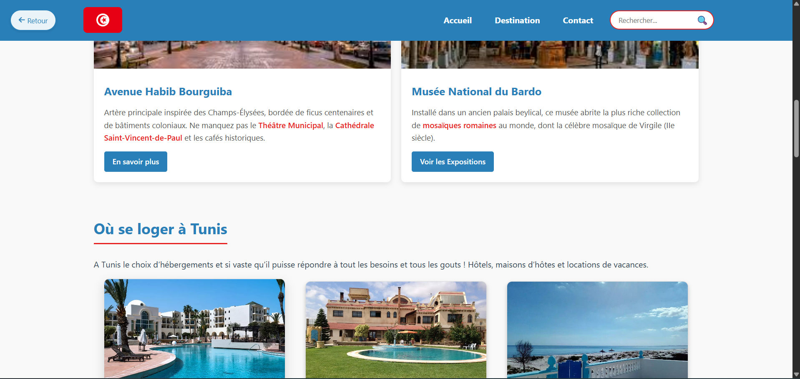
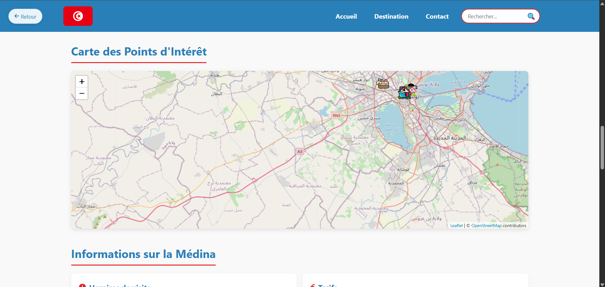
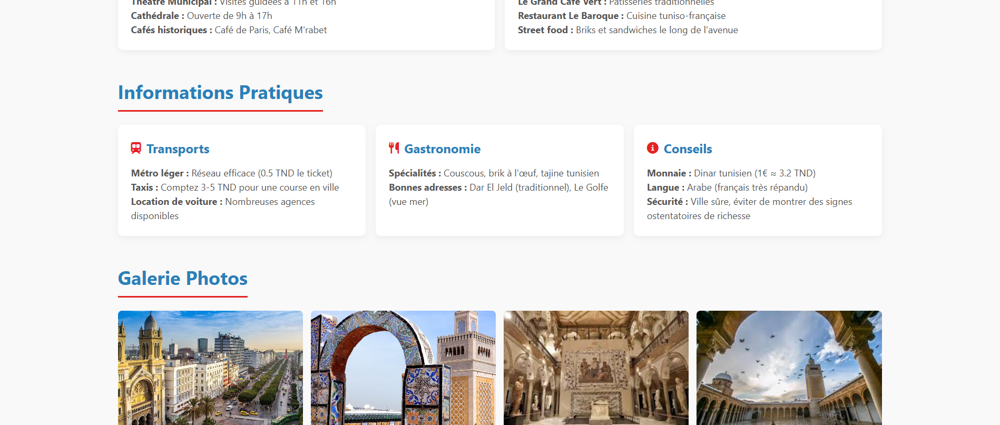
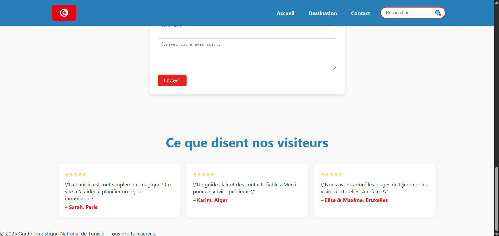
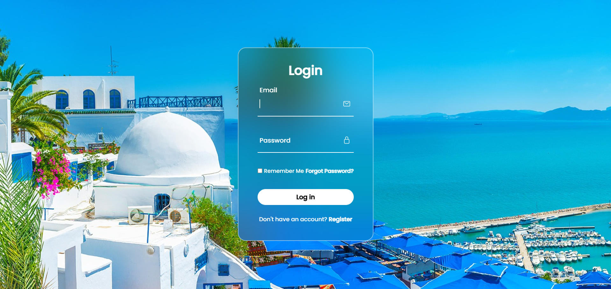

# Tunisia_Guide_Website

A modern and responsive web application designed to showcase the beauty of Tunisia — from its golden beaches to its historic ruins.
The website provides a user-friendly interface with navigation, destination highlights, and search functionality.

# Features

Landing Page: A welcoming hero section with background video/image and a clear call-to-action.

Navigation Bar: Simple and responsive, includes links to:

Home (Accueil)

Destination

Contact

Search Bar: Allows users to quickly find content on the site.

Login Button: Redirects users to authentication or member features.

Multilingual Ready: Currently in French but can be adapted for English or other languages.

# Technologies Used

HTML5: Structure and content of the site.

CSS3: Styling, responsiveness, and animations.

JavaScript: Interactivity and dynamic components.

# Installation & Usage

Clone the repository:

git clone https://github.com/your-username/Tunisia_Guide_Website.git

Open the project folder:

cd Tunisia_Guide_Website

Launch Projet.html in your browser.

No additional setup is required since this is a static front-end project.

# Screenshots

